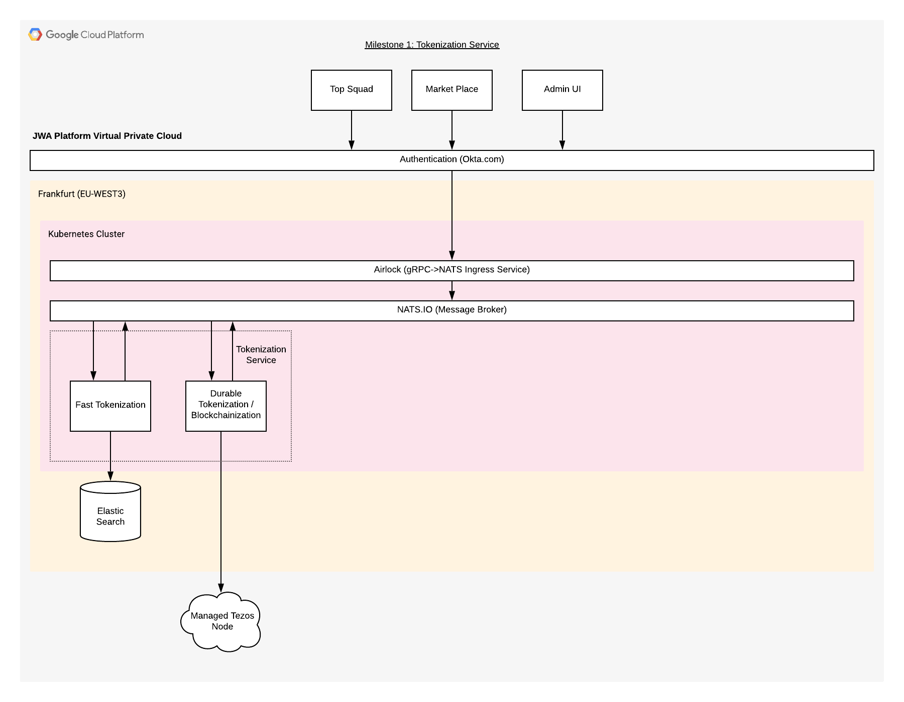

# Architecture

The JWA Platform is an advanced platform cloud platform that was built for scalability.

Scalability is obtained using a microservices architecture with inter-process communication achieved using a message broker called [NATS.io].
To interact with the platform, a [gRPC] call is made to [Airlock], which is an ingress service converting a [gRPC] call in its equivalent [NATs.io] request.
The reponse is returned or streamed back to the [gRPC] client via [Airlock]

[NATS.io]:https://nats.io/
[gRPC]:https://grpc.io/
[Airlock]:https://github.com/jwa-lab/airlock