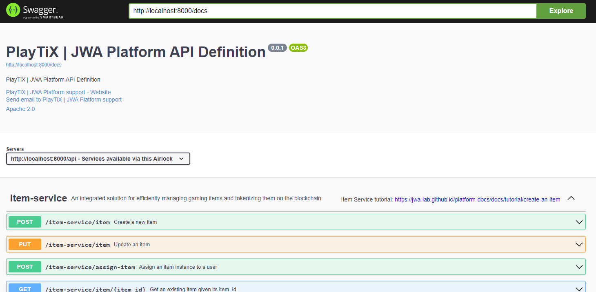

# API Reference

The API reference is provided under the [OpenAPI 3 specifications](https://swagger.io/specification/).
The API docs are dynamically generated based on the services currently running behind an Airlock.

When running the [Community Platform](https://github.com/jwa-lab/community-platform), the docs can be loaded in swagger.

### Navigate to your local swagger, which is started by the platform itself

1. Navigate to [http://localhost:8080](http://localhost:8080).
2. Ensure `http://localhost:8000/docs` is set in the url field at the top

