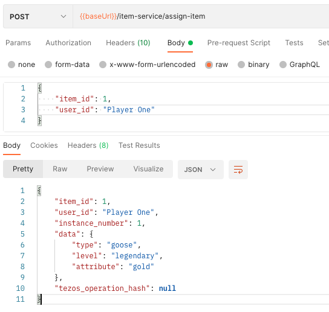
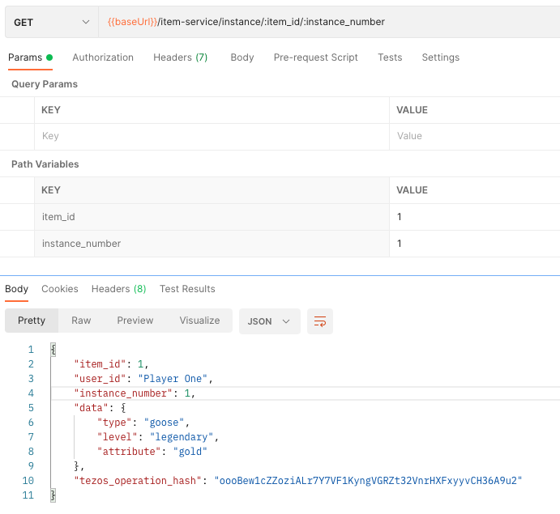

# Assign an item

## Item instances

We have created a Golden Goose and someone bought it from us. We are going to create an instance for that user.

An instance is an item that has been assigned to a user. After being assigned, an item can start evolving independently from the same item assigned to other users.

When an instance is assigned, the related item's available quantity decreases by one. The item is "out of stock" when all instances have been assigned.

Also, instances of the same item evolving differently is what makes the time spent using an item valuable. Its new characteristics will give value to that instance and each instance having evolved differently will have a different value.

## Assigning an instance

To assign an instance to a user, locate the "Assign an item instance to a user" request in Postman.

Click on "Body", set the following values and hit Send.

```
{
    "item_id": 1,
    "user_id": "Player One"
}
```

We are going to assign item 1 to Player One and should be getting the following response:

```
{
    "item_id": 1,
    "user_id": "Player One",
    "instance_number": 1,
    "data": {
        "type": "goose",
        "level": "legendary",
        "attribute": "gold"
    },
    "tezos_operation_hash": null
}
```

-   `instance_number` indicates the Player 1 has received the first instance of that item. If we retrieved the corresponding item we would see that its `available_quantity` field is now `0` and the item can't be assigned anymore.
-   `data` is empty but should be populated with the values from the original item since it hasn't evolved yet. This issue is being fixed.
-   `tezos_operation_hash` will contain the operation hash to track the tokenization status, but tokenization hasn't happened yet.



To locate the instance in the blockchain given its tokenization information, please follow [this documentation](/docs/tokenization/tezos).

## Retrieving an instance

Let's now try to retrieve the instance. For that, we need the `item_id` and the `instance_number`.

Locate the "Get an item instance given its item_id and instance_number" request, go to "Params" and set `item_id` to `1` and `instance_number` to `1`, and hit Send.

This will return the new instance, which is clearly assigned to a user, has the initial item fields since we haven't updated the instance yet, and we can see that the tezos tokenization information have been added.

```json
{
    "item_id": 1,
    "user_id": "Player One",
    "instance_number": 1,
    "data": {
        "type": "goose",
        "level": "legendary",
        "attribute": "gold"
    },
    "tezos_operation_hash": "oooBew1cZZoziALr7Y7VF1KyngVGRZt32VnrHXFxyyvCH36A9u2"
}
```



## Updating an instance

As we've already discussed, when a player uses an item, this item should evolve and give it unique characteristics that will differenciate it from the other instances of that item.
This uniqueness is what gives it its value and what the player wish to see persisted in the blockchain. While an item can't change after being frozen, the instance can always evolve.
Evolving an item means altering its fields, and the new values for those fields will replace or augment the original characteristics from the item.

Let say that our Golden Goose is evolving and while still being a legendary Golden Goose, showing it around had it develop some patina and accumulate a few scratches.

We will change gold to "gold with patina" and add a "scratchiness" attribute.

Locate the "update an item instance data" request and pass the following payload in the body:

```json
{
    "item_id": 1,
    "instance_number": 1,
    "data": {
        "attribute": "gold with patina",
        "scratchiness": "low"
    }
}
```

And if I retrieve the item instance:


We can see that the instance's data will override the item's data, or "shadow" it.
