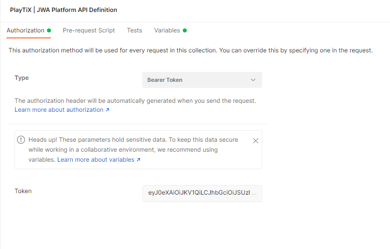

# Authorization

To use the platform, we need to be authenticated. Fortunately, the community platform embeds a mock authentication service.

Let's obtain a ``user`` Bearer Token:

```bash
% curl --location --request GET 'http://localhost:8999/oauth2/default/v1/token'
```

This will return a JWT which looks like this:

```json
{
    "token": "eyJ0eXAi...RGImmtDsSaa4ua_gnuyLvA"
}
```

In the following setp of the tutorial, a studio token will be required. In order to get one, you can call the same endpoint with the parameter ``token_type=studio``

```bash
% curl --location --request GET 'http://localhost:8999/oauth2/default/v1/token?token_type=studio'
```

A studio token differs from a user token at the `studio` claim level stored in the token. This claim will allow you to operate as a studio, and therefore use our studio-oriented APIs. 

Then click on the "PlayTiX | JWA Platform API Definition" Collection and paste the token (`eyJ0....Lva`) inside the Token field. Type should be set to `Bearer Token` like so:



You will have to configure the token everytime the platform restarts.

Now that we are ready to go, let's create NFTs!
