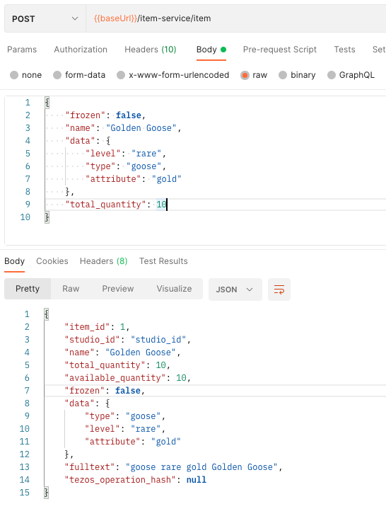
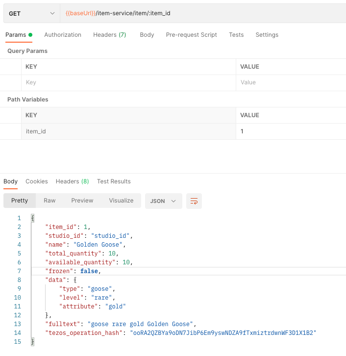
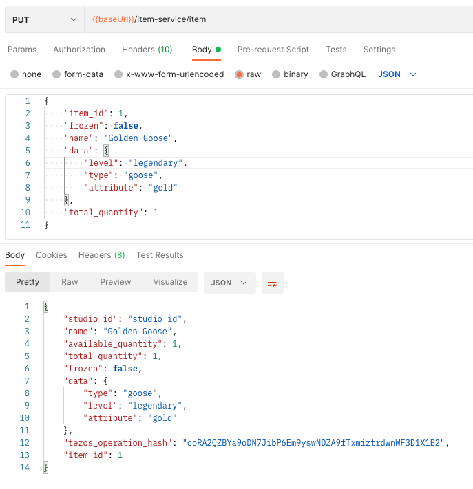

# Create a new item

Let's start by creating an item in the platform. An item can be used in your video games. For instance,
if you're a farmer raising poultry, you may hope to one day find a golden goose. A golden goose is a very rare and desirable animal,
so we'll only create 10 of them. We'll start by adding the golden goose to the `Item Service`. Locate the "Create a new item" request in Postman and update
the fields to these values in the Body tab.

```json
{
    "frozen": false,
    "name": "Golden Goose",
    "data": {
        "level": "rare",
        "type": "goose",
        "attribute": "gold"
    },
    "total_quantity": 10
}
```

And hit "send". This will return the new item, including the automatically populated ones:

```json
{
    "item_id": 1,
    "studio_id": "studio_id",
    "name": "Golden Goose",
    "total_quantity": 10,
    "available_quantity": 10,
    "frozen": false,
    "data": {
        "type": "goose",
        "level": "rare",
        "attribute": "gold"
    },
    "fulltext": "goose rare gold Golden Goose",
    "tezos_operation_hash": null // The tokenization operation information, will be set when the tokenization request is sent.
}
```



## Retrieve item

We have now created our first item in the platform. Let's retrieve it to see what it looks like.
Locate the "Get an existing item given its item_id" request and set `item_id` param in "Params" to 1.

this should return the original item with some additional information:

```json
{
    "item_id": 1,
    "studio_id": "studio_id",
    "name": "Golden Goose",
    "total_quantity": 10,
    "available_quantity": 10,
    "frozen": false,
    "data": {
        "type": "goose",
        "level": "rare",
        "attribute": "gold"
    },
    "fulltext": "goose rare gold Golden Goose",
    "tezos_operation_hash": "ooRA2QZBYa9oDN7JibP6Em9yswNDZA9fTxmiztrdwnWF3D1X1B2"
}
```

-   `item_id`: We can see that the item_id has been added and is set to 1. This field can't be changed.
-   `studio_id`: the studio_id field contains the unique id for authenticated studio. This is a hard coded value from our mock authentication service but this will be a different value for each studio. This allows us to verify that only the owner of the item may change it or assign it to a user.
-   `tezos_operation_hash`: The operation hash that tracks the operation. You can track the operation status in the Tezos explorer started by the platform: http://localhost:8002/explorer/op/`<put the tezos operation hash here>`

Please note that `tezos_operation_hash` represents the last operation that was executed on that item. If the item gets updated, the `tezos_operation_hash` field will only be updated when the new operation is sent, and it will show the old value until then.



To locate the item in the blockchain given its tokenization information, please follow [this documentation](/docs/tokenization/tezos).

## Update item

Let's assume that we made a mistake when we created the item. A Golden Goose is actually more than rare, it's legendary and there can only be one.
Locate the "Update an item" request and update the required values, then hit Send.

```json
{
    "item_id": 1,
    "frozen": false,
    "name": "Golden Goose",
    "data": {
        "level": "legendary",
        "type": "goose",
        "attribute": "gold"
    },
    "total_quantity": 1
}
```

This will return the updated item.



Awesome, we can now create, update and get items.

## Freeze Item

You may have noticed the `frozen` field. Setting it to `true` means that the item may no longer be updated. This should give confidence to your users that the items they've purchased can't change anymore.
There is a check in the smart contracts to verify the value of the `frozen` field, so this is set in stone and can't be changed just like the smart contract itself can't change.
To freeze the item, locate the "Freeze an item." request, open it and set the `item_id` in the body:

```json
{
    "item_id": 1
}
```

.

Note: it's also possible to freeze an item by using the `update item` endpoint and simply setting the `frozen` value to true.

Great! Let's now assign items to users!
