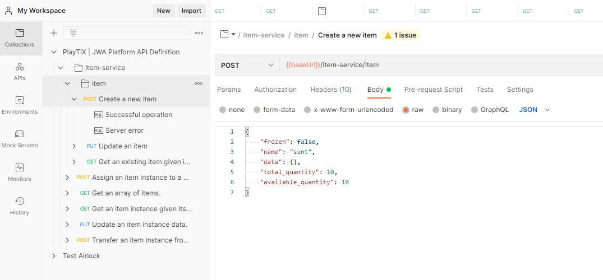

# Getting started

## What will we do?

By following this tutorial you will be able to:

-   Run a complete JWA Platform on your local machine
-   Create a video game item and allocate a finite quantity
-   Tokenize it on the blockchain (mint an NFT)
-   Assign the item to a user and make it evolve
-   Transfer the item to another user

## What do you need?

To use this platform, you will need the following tools installed on your local machine:

1. [Node.js](https://nodejs.org/en/) with [NPM](https://www.npmjs.com/), to install the platform
1. [Docker](https://www.docker.com/), to run the platform
1. An HTTP Client such as [Postman](https://www.postman.com/) or [curl](https://curl.se/) to make API calls.

## Related documentation

We suggest you to complete the tutorial first, but if you're eager to understand how items/instances are tokenized on the blockchain, you may read [the Tokenization documentation](/docs/tokenization/tokenization) first.
The [Tezos documentation](/docs/tokenization/tezos) helps you locate your tokenized items and instances in Tezos.

## Install

Make sure you have [Docker](https://docs.docker.com/get-docker/) and [Node.js](https://nodejs.org/en/download/) installed first.

Then simply install the community platform globally on your machine:

```bash
% npm install -g @jwalab/community-platform

changed 11 packages, and audited 12 packages in 2s

2 packages are looking for funding
  run `npm fund` for details

found 0 vulnerabilities
```

You should have it globally installed:

```bash
% jwalab --help

Usage: jwalab a.k.a JWA Community platform [global options] command

JWA_LAB - v0.1.0
Run a JWA Community platform (jwalab) on your local machine!


Options:
  -V, --version   output the version number
  -h, --help      display help for command

Commands:
  start           start the jwalab environment
  stop            stop the jwalab environment
  kill            kill the jwalab environment
  pull            download the latest versions of the platform's services
  tezos-client    run a command in the tezos-client
  granabox        run a command in granabox
  help [command]  display help for command
```

## Start

```bash
% jwalab start

Creating network "community-platform_default" with the default driver
Creating community-platform_postgres_1              ... done
Creating community-platform_swagger-ui_1            ... done
Creating community-platform_tzbox_1                 ... done
Creating community-platform_authorization-service_1 ... done
Creating community-platform_nats_1                  ... done
Creating community-platform_tzindex_1               ... done
Creating community-platform_item-service_1          ... done
Creating community-platform_airlock_1               ... done
Creating community-platform_tzstats_1               ... done
Creating community-platform_tezos-work-queue_1      ... done
```

Verify that everything is running:

```bash
 % docker ps
CONTAINER ID   IMAGE                                COMMAND                  CREATED          STATUS          PORTS                                                                                                                             NAMES
ed53821329cc   jwalab/tezos-work-queue:0.0.1        "sh -c 'sleep 10 && …"   47 seconds ago   Up 34 seconds                                                                                                                                     community-platform_tezos-work-queue_1
efda141448be   blockwatch/tzstats                   "/bin/sh -c serve"       47 seconds ago   Up 46 seconds   8000/tcp, 0.0.0.0:8001->8001/tcp, :::8001->8001/tcp                                                                               community-platform_tzstats_1
de836f7d94d9   jwalab/airlock:0.0.8                 "npm run start"          47 seconds ago   Up 46 seconds   0.0.0.0:8000->8000/tcp, :::8000->8000/tcp                                                                                         community-platform_airlock_1
f73cc040c295   jwalab/item-service:0.0.1            "sh -c 'npm run seed…"   47 seconds ago   Up 47 seconds                                                                                                                                     community-platform_item-service_1
8dfa18c2a4f3   blockwatch/tzindex:v9.1-rc2          "docker-entrypoint.s…"   48 seconds ago   Up 47 seconds   8000/tcp, 0.0.0.0:8002->8002/tcp, :::8002->8002/tcp                                                                               community-platform_tzindex_1
a72815bcfab9   nats:latest                          "/nats-server -js"       49 seconds ago   Up 47 seconds   0.0.0.0:4222->4222/tcp, :::4222->4222/tcp, 0.0.0.0:6222->6222/tcp, :::6222->6222/tcp, 0.0.0.0:8222->8222/tcp, :::8222->8222/tcp   community-platform_nats_1
57a624580769   tqtezos/flextesa:20210602            "granabox start"         49 seconds ago   Up 48 seconds   0.0.0.0:20000->20000/tcp, :::20000->20000/tcp                                                                                     community-platform_tzbox_1
bba743701610   jwalab/authorization-service:0.0.4   "npm run start"          49 seconds ago   Up 47 seconds   0.0.0.0:8999->8999/tcp, :::8999->8999/tcp                                                                                         community-platform_authorization-service_1
9be090c0d0d7   swaggerapi/swagger-ui                "/docker-entrypoint.…"   49 seconds ago   Up 48 seconds   80/tcp, 0.0.0.0:80->8080/tcp, :::80->8080/tcp                                                                                     community-platform_swagger-ui_1
568c0bc9d977   postgres                             "docker-entrypoint.s…"   49 seconds ago   Up 48 seconds   0.0.0.0:5432->5432/tcp, :::5432->5432/tcp                                                                                         community-platform_postgres_1
```

You're now up and running!

## Documentation

The platform offers its documentation as OpenAPI specifications.
This means you can view it in a tool like swagger, or load it up in Postman.

### Swagger

To see what the documentation looks like in Swagger, simply open [localhost](http://localhost/). It should looks like this:


### Postman

Even better, we can run the documentation using Postman or equivalent:

1. Open Postman
2. click Import in the top-left corner
3. In the new window, click on link and enter `http://localhost:8000/docs`
4. click Continue, then Import.
5. You should now see the PlayTiX collection under "Collections"



We recommend using the Postman option to follow this tutorial.
