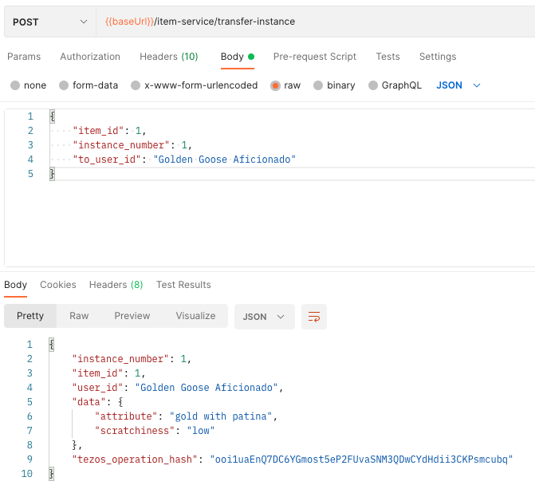

# Transfer an item

Player One had their Golden Goose for some time and it has developed a nice patina. A Golden Goose aficionado is offering Player One some money in exchange for the Golden Goose
so we need to transfer it to the new owner.

The operation has to be executed by the owner of the item (the studio) and on behalf of Player One. Additional permissions will be implementer later on to cover more transfer scenarios but this will do for now.

Locate the "Tranfer an item instance from a player to another" request, and set the Body as follows:

```json
{
    "item_id": 1,
    "instance_number": 1,
    "to_user_id": "Golden Goose Aficionado"
}
```



And that's it!